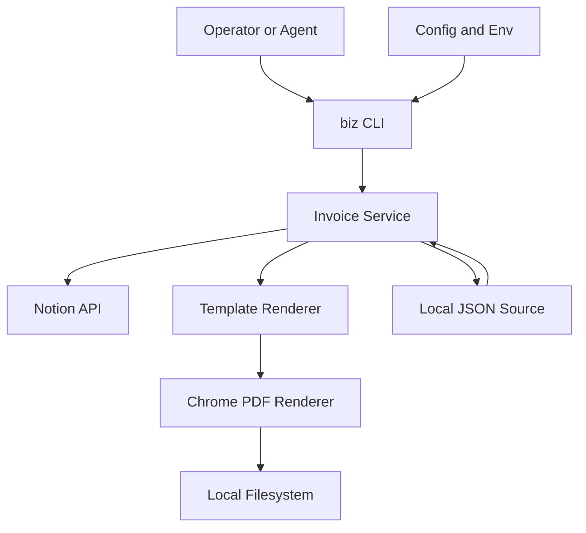

## Executive summary
`biz` is a local, operator-run CLI that processes contractual/confidential invoice data and integrates with Notion. The highest-risk themes are credential/token misuse, unsafe rendering/execution paths in PDF generation, and integrity risks from untrusted invoice source data crossing into status-changing operations. Because the tool runs on your own machine (not internet-exposed as a service), remote pre-auth risks are lower than local compromise, malicious content ingestion, and agent overreach risks.

## Scope and assumptions
- In scope:
  - Runtime CLI and command orchestration: `cmd/biz/main.go`, `internal/command/root.go`, `internal/modules/invoice/module.go`
  - Invoice workflows and data handling: `internal/invoice/service.go`, `internal/invoice/workflow_create.go`, `internal/invoice/workflow_preview.go`, `internal/invoice/workflow_list.go`, `internal/invoice/validate.go`
  - External integration boundary (Notion): `internal/invoice/notion/client.go`, `internal/invoice/notion/mapper.go`
  - Rendering and artifact storage: `internal/invoice/render/chromedp.go`, `internal/invoice/render/template.go`, `internal/invoice/pdf/store_local.go`
  - Config and secrets loading: `internal/platform/config/config.go`
- Out of scope:
  - Notion service internals (SaaS-side controls)
  - Host OS hardening beyond what this repo controls
  - Non-runtime docs/tests/fixtures as production controls
- Validated assumptions from user:
  - Runs only on owner-controlled machines.
  - Data handled is contractual/confidential.
  - Agents will eventually invoke commands on the same machine.
- Open questions that could materially change ranking:
  - How agent invocation will be permission-scoped (read-only vs status-changing commands).
  - Whether local filesystem directories are shared with other users/processes.

## System model
### Primary components
- CLI entrypoint and command dispatcher (`cmd/biz/main.go`, `internal/command/root.go`).
- Invoice module (create/list/preview) with config-driven defaults (`internal/modules/invoice/module.go`).
- Invoice domain service (validation, idempotency, source selection, tax application, render/store pipeline) (`internal/invoice/service.go`, `internal/invoice/workflow_create.go`).
- Notion adapter using bearer token over HTTPS with retries (`internal/invoice/notion/client.go`).
- HTML template + Chrome-based PDF rendering (with fallback PDF renderer) (`internal/invoice/render/template.go`, `internal/invoice/render/chromedp.go`).
- Local artifact and idempotency persistence (`internal/invoice/pdf/store_local.go`, `internal/invoice/service.go`).

### Data flows and trust boundaries
- Operator/Agent -> `biz` CLI process
  - Data: command args, env vars, optional config path.
  - Channel: local process invocation / shell.
  - Security guarantees: OS user boundary only; no app-level authn/authz in CLI.
  - Validation: command arg checks + workflow validation.
- Local config/env -> runtime config loader
  - Data: Notion token, DB ID, file paths, timeouts.
  - Channel: local file + environment variables (`viper`).
  - Security guarantees: relies on local file permissions and secret hygiene.
  - Validation: structural unmarshal/defaults; limited semantic validation.
- `biz` -> Notion API
  - Data: bearer token, invoice IDs, status updates, query filters.
  - Channel: HTTPS requests via `net/http` client.
  - Security guarantees: TLS transport, token-based auth header.
  - Validation: response code handling, JSON unmarshal; no response signing/pinning.
- Notion/local JSON -> invoice domain -> HTML/PDF renderer
  - Data: untrusted text and numeric invoice fields.
  - Channel: in-process object mapping and template rendering.
  - Security guarantees: business validation exists for required fields and numeric bounds.
  - Validation: invoice validation checks; no explicit output-encoding policy beyond `html/template` default escaping.
- Renderer -> local filesystem
  - Data: PDF bytes, preview HTML/PDF, idempotency JSON state.
  - Channel: file writes.
  - Security guarantees: OS-level permissions.
  - Validation: sanitized invoice number for PDF filename; no path allowlist for operator-provided out paths.

#### Diagram

## Assets and security objectives
| Asset | Why it matters | Security objective (C/I/A) |
|---|---|---|
| Notion integration token | Grants read/write to invoice/worklog/cost data and status mutation | C, I |
| Contractual/confidential invoice/worklog/cost content | Business-sensitive client and contract context | C |
| Invoice totals/status integrity | Incorrect totals/status can cause financial/reporting errors | I |
| Generated PDFs and previews | Shareable client artifacts; may leak sensitive data | C, I |
| Idempotency store (`invoices/.idempotency.json`) | Controls replay behavior and artifact references | I, A |
| Runtime availability (create/list/preview) | Needed for billing operations continuity | A |
| CI build artifacts/container image | Supply-chain trust for distributed binary/image | I |

## Attacker model
### Capabilities
- Can influence invoice content if attacker can modify Notion records used by this integration.
- Can exploit weak local host hygiene (token leakage, insecure file permissions, malicious local process invoking CLI).
- Could be an over-privileged local agent automation invoking destructive/high-impact commands.
- Can trigger dependency outages/throttling at Notion boundary (availability pressure).

### Non-capabilities
- No direct internet-exposed API endpoint in this repo for remote anonymous attack (CLI-only runtime).
- No multi-tenant service boundary in current deployment model (single owner machine).
- No direct database/network listener attack surface in repo runtime path.

## Entry points and attack surfaces
| Surface | How reached | Trust boundary | Notes | Evidence (repo path / symbol) |
|---|---|---|---|---|
| CLI args (`create/list/preview`, output/source flags) | Local shell/agent invocation | Operator/Agent -> CLI | No built-in per-command authorization | `internal/modules/invoice/module.go` |
| Config file + env vars | Auto load from cwd/home and env | Local config/env -> runtime | Secrets may leak via mismanaged files/env | `internal/platform/config/config.go` |
| Notion API response payloads | HTTPS API calls | External SaaS -> local process | Data mapped into invoice fields and rendered | `internal/invoice/notion/client.go`, `internal/invoice/notion/mapper.go` |
| Local JSON fallback source | `--source local` or fallback path | Local file -> domain service | JSON schema trust is minimal | `internal/invoice/datasource/localjson.go` |
| HTML template rendering | InvoiceDocument into template | Domain -> renderer | Template parsing/runtime failures influence availability | `internal/invoice/render/template.go` |
| Chrome PDF renderer | HTML converted to PDF | Renderer -> external binary process | Runs Chrome with `--no-sandbox` | `internal/invoice/render/chromedp.go` |
| Output filesystem paths | out dir / temp dir writes | Process -> filesystem | Path control mostly operator-driven, not allowlisted | `internal/invoice/pdf/store_local.go`, `internal/invoice/workflow_create.go` |
| Notion status update | `--upload-notion` create path | Local process -> SaaS state | Integrity-sensitive mutation of invoice status | `internal/invoice/workflow_create.go`, `internal/invoice/notion/client.go` |

## Top abuse paths
1. **Steal Notion token to exfiltrate confidential data** -> attacker gets local env/config access -> extracts token -> queries/patches Notion data -> confidentiality and integrity loss.
2. **Inject malicious/hostile invoice content via Notion** -> attacker edits source pages -> content flows to HTML/PDF rendering -> exploit browser/PDF pipeline weakness or poison artifacts.
3. **Agent overreach changes business state** -> local agent runs `invoice create ... --upload-notion` on wrong IDs -> marks statuses incorrectly and emits wrong artifacts.
4. **Path abuse for artifact leakage** -> agent/operator sets unsafe `--out` path -> writes sensitive PDFs into shared/synced location -> unauthorized disclosure.
5. **Replay/integrity confusion through local idempotency file tampering** -> attacker modifies `.idempotency.json` -> CLI reuses stale/malicious metadata -> incorrect operational outcomes.
6. **Notion outage / rate-limit pressure** -> repeated transient failures -> fallback behavior and retries delay runs -> billing workflow unavailability.
7. **Supply-chain compromise in container/dependencies** -> compromised dependency/image layer enters build pipeline -> malicious binary behavior on operator machine.

## Threat model table
| Threat ID | Threat source | Prerequisites | Threat action | Impact | Impacted assets | Existing controls (evidence) | Gaps | Recommended mitigations | Detection ideas | Likelihood | Impact severity | Priority |
|---|---|---|---|---|---|---|---|---|---|---|---|---|
| TM-001 | Local attacker/process | Access to local env/files/shell history | Extract Notion token and use API directly | Confidential data exposure and unauthorized status mutation | Notion token, confidential data, status integrity | Token presence checks only (`ensureToken`) and secret guidance docs (`SECURITY.md`) | No token scoping/rotation workflow in app; no secret source hardening | Use OS keychain/secret manager, short-lived tokens where possible, least-privilege Notion access, token rotation runbook | Alert on unusual Notion query/update volumes; local shell/env audit | medium | high | high |
| TM-002 | Malicious data editor in Notion | Ability to edit related Notion records | Inject hostile content into rendered HTML/PDF path | Potential local compromise or artifact poisoning | Host integrity, PDF artifact integrity/confidentiality | `html/template` escaping and invoice field validation | Chrome launched with `--no-sandbox`; no content sanitization policy for untrusted rich text | Remove `--no-sandbox` where feasible; run renderer in isolated container/user namespace; sanitize or strip high-risk content fields before rendering | Log render failures/crashes with trace IDs; alert on repeated renderer crashes | medium | high | high |
| TM-003 | Over-privileged local agent | Agent can invoke CLI commands freely | Run create/upload on unintended invoices and mutate Notion status | Business process corruption and incorrect billing state | Invoice totals/status integrity | Validation and explicit `--upload-notion` option (`workflow_create`) | No policy gate/allowlist per agent action; no dry-run approval control | Add policy layer (allowlisted IDs/status transitions), explicit `--confirm` for mutating ops, agent role separation | Audit log command+invoice_id+status changes; detect anomalous batch mutations | high | medium | high |
| TM-004 | Local user/process misconfiguration | Ability to set config/flags | Route output PDFs to insecure path/sync target | Confidential invoice disclosure | Generated PDFs/previews | Filename sanitization (`sanitize`) and local write error handling | No output path policy or permission checks | Enforce output base directory allowlist, optional chmod 0600 for artifacts, warning on world-readable/shared dirs | Monitor artifact path deviations and permissions at write time | medium | medium | medium |
| TM-005 | Local tampering | Write access to idempotency file | Modify `.idempotency.json` to force replay/stale metadata | Integrity degradation of automation outcomes | Idempotency store, workflow integrity | Deterministic idempotency key generation (`idempotencyKey`) | Store is unsigned/plain JSON with default file perms; no tamper detection | Add HMAC/signature for idempotency records or move to sqlite with integrity checks and file locking | Log key/result mismatches and replay anomalies | low | medium | medium |
| TM-006 | Dependency/SaaS availability attacker or outage | Notion downtime/rate limit conditions | Cause repeated API failures and operation delays | Billing operation downtime | Runtime availability | Timeouts/retries/backoff and optional local fallback (`notion/client.go`, `fetchDraft`) | No circuit breaker/queueing; fallback may be stale | Add bounded retry budgets per command, cache freshness metadata, circuit breaker and operator fallback guidance | Track failure rate, latency, fallback-used metric with alerts | medium | medium | medium |
| TM-007 | Build supply-chain attacker | Compromised dependency or base image | Inject malicious code into binary/container | Full host compromise or data exfiltration | Build artifacts, host/data integrity | CI tests/vet/build/docker-smoke (`.github/workflows/ci.yml`) | No dependency/SBOM/signature scanning, no provenance attestation | Add `govulncheck`, dependency pin review, SBOM generation, image signing and provenance in CI | Alert on vulnerable deps/base images; verify signatures on release artifacts | low | high | medium |

## Criticality calibration
- **critical (for this repo):** likely + high-impact compromise of token or host execution path causing broad confidential data exfiltration/integrity loss.
  - Example: proven renderer escape leading to local code execution with access to token.
  - Example: autonomous agent mass-mutating invoice status without controls.
- **high:** realistic abuse with major confidentiality/integrity impact but requiring local foothold or specific permissions.
  - Example: token theft from weak local secret handling (TM-001).
  - Example: malicious Notion content reaching unsandboxed renderer path (TM-002).
  - Example: agent overreach on mutating commands (TM-003).
- **medium:** meaningful operational/integrity issues with narrower blast radius or stronger prerequisites.
  - Example: insecure output path leakage (TM-004).
  - Example: idempotency store tampering (TM-005).
  - Example: Notion availability degradation (TM-006).
- **low:** limited impact, unlikely preconditions, or easily reversible with existing controls.
  - Example: non-sensitive metadata disclosure in local logs.
  - Example: transient single-run failure with immediate operator recovery.

## Focus paths for security review
| Path | Why it matters | Related Threat IDs |
|---|---|---|
| `internal/invoice/render/chromedp.go` | Launch flags and renderer isolation determine exploitability of hostile invoice content | TM-002 |
| `internal/invoice/notion/client.go` | Token handling, outbound auth, retries, and status mutation boundary to external SaaS | TM-001, TM-003, TM-006 |
| `internal/invoice/workflow_create.go` | Core mutating workflow and upload/status transition logic | TM-003, TM-004, TM-006 |
| `internal/platform/config/config.go` | Secret/config ingestion paths and profile behavior | TM-001, TM-004 |
| `internal/invoice/service.go` | Idempotency store handling and source fallback logic | TM-005, TM-006 |
| `internal/invoice/pdf/store_local.go` | Artifact write path, filename/path safety, file permission behavior | TM-004 |
| `.github/workflows/ci.yml` | Build supply-chain posture and missing security gates | TM-007 |
| `Dockerfile` | Runtime dependency/base-image trust and attack surface | TM-002, TM-007 |

## Quality check
- Covered discovered runtime entry points (CLI args, config/env, Notion API, local JSON, renderer, filesystem writes).
- Mapped each major trust boundary to at least one threat.
- Separated runtime threats from CI/build/supply-chain threats.
- Reflected user clarifications (single-machine deployment, confidential data, future local agents).
- Kept assumptions and open questions explicit.
